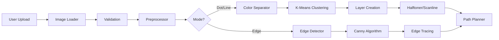
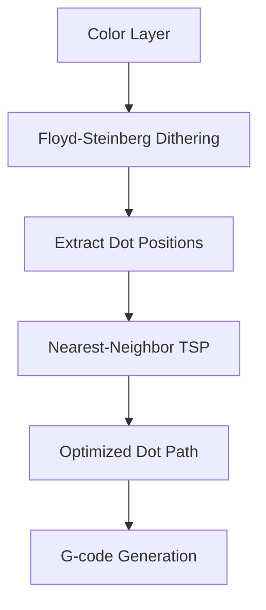
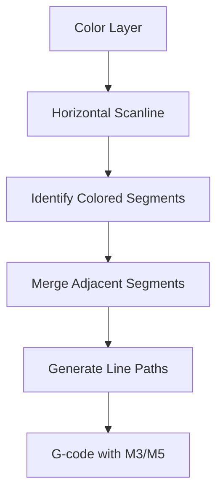
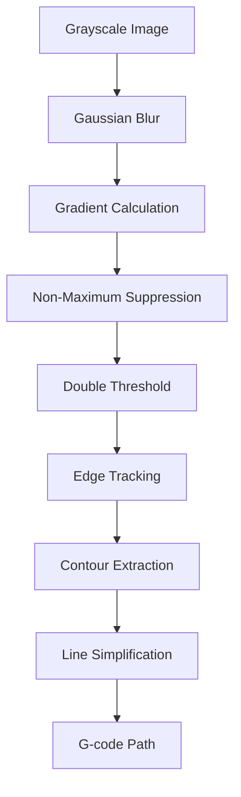
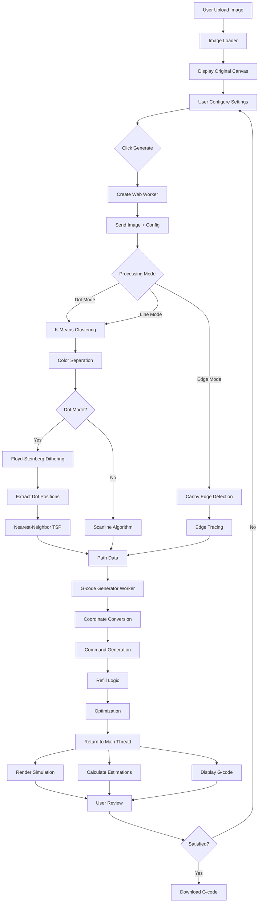
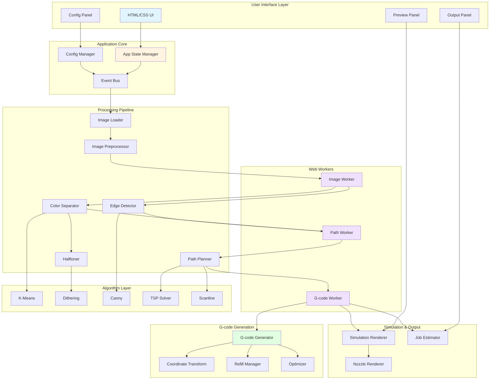

# MuralBot G-Code Generator - Architecture Document

## Executive Summary

This document outlines the complete architecture for a high-performance, client-side web application that converts images into G-code for a cable-driven wall-painting robot. The architecture prioritizes performance and scalability to handle large images (4K+) efficiently while maintaining a clean, maintainable codebase.

---

## 1. Technology Stack

### 1.1 Core Technologies

#### **Vanilla JavaScript (ES6+) with Web Workers**
**Justification:**
- **Performance**: Direct control over optimization, no framework overhead
- **Web Workers**: Offload heavy image processing to background threads, keeping UI responsive
- **Native APIs**: Direct access to Canvas API, OffscreenCanvas for maximum performance
- **No Build Step**: Simple deployment, no transpilation needed for modern browsers
- **Memory Control**: Manual memory management for large image buffers

#### **HTML5 Canvas API + OffscreenCanvas**
**Justification:**
- **Native Performance**: Hardware-accelerated rendering
- **OffscreenCanvas**: Process images in Web Workers without blocking main thread
- **ImageData API**: Direct pixel manipulation for image processing
- **Multiple Canvas Support**: Separate canvases for original image, preview, and processing

#### **CSS Grid + Flexbox**
**Justification:**
- **Responsive Layout**: Three-panel design (config, preview, output)
- **Native Performance**: No CSS framework overhead
- **Modern Browser Support**: Works in all target browsers
- **Simple Maintenance**: Standard CSS, easy to understand and modify

### 1.2 Key Libraries

#### **Image Processing: Custom Implementation**
**Justification:**
- **Performance Critical**: Libraries like jimp.js are too slow for large images
- **Custom Algorithms**: Floyd-Steinberg dithering, K-means clustering optimized for our use case
- **Memory Efficient**: Process images in chunks to avoid memory issues
- **No Dependencies**: Reduce bundle size and maintain control

#### **Edge Detection: Custom Canny Implementation**
**Justification:**
- **Lightweight**: Existing libraries (opencv.js) are 8MB+, too heavy for web
- **Optimized**: Simplified Canny algorithm sufficient for our needs
- **Web Worker Compatible**: Can run in background thread

#### **TSP Optimization: Custom Nearest-Neighbor**
**Justification:**
- **Fast**: O(n²) complexity acceptable for thousands of points
- **Predictable Performance**: No worst-case exponential behavior
- **Simple Implementation**: Easy to maintain and debug
- **Sufficient Quality**: Good enough paths for painting application

#### **Color Quantization: Fast K-Means**
**Justification:**
- **Industry Standard**: K-means clustering for color reduction
- **Optimized Implementation**: Use typed arrays and spatial indexing
- **Configurable**: Support 1-10 colors as per requirements

### 1.3 Browser APIs

- **File API**: Image upload handling
- **Web Workers API**: Parallel processing
- **Canvas API / OffscreenCanvas**: Image rendering and processing
- **Blob API**: G-code file download
- **LocalStorage API**: Save user configurations

---

## 2. Application Architecture

### 2.1 High-Level Structure

```
muralbot-gcode-generator/
├── index.html                 # Main HTML file
├── css/
│   ├── styles.css            # Main styles
│   ├── layout.css            # Three-panel layout
│   └── components.css        # UI component styles
├── js/
│   ├── main.js               # Application entry point
│   ├── core/
│   │   ├── app.js            # Application state manager
│   │   ├── config.js         # Configuration manager
│   │   └── eventBus.js       # Event system for component communication
│   ├── ui/
│   │   ├── configPanel.js    # Left panel - configuration tabs
│   │   ├── previewPanel.js   # Center panel - canvas displays
│   │   ├── outputPanel.js    # Right panel - G-code output
│   │   └── components/
│   │       ├── tabManager.js
│   │       ├── fileUploader.js
│   │       └── colorPicker.js
│   ├── processors/
│   │   ├── imageLoader.js        # Image upload and validation
│   │   ├── imagePreprocessor.js  # Resize, format conversion
│   │   ├── colorSeparator.js     # K-means clustering, layer separation
│   │   ├── edgeDetector.js       # Canny edge detection
│   │   ├── halftoner.js          # Floyd-Steinberg dithering
│   │   └── pathPlanner.js        # Dot/line/edge path generation
│   ├── algorithms/
│   │   ├── kmeans.js             # K-means clustering
│   │   ├── dithering.js          # Floyd-Steinberg algorithm
│   │   ├── canny.js              # Canny edge detection
│   │   ├── tsp.js                # Nearest-neighbor TSP
│   │   └── scanline.js           # Scanline rasterization
│   ├── gcode/
│   │   ├── generator.js          # Main G-code generation
│   │   ├── coordinateSystem.js   # Cartesian to trilateration
│   │   ├── refillManager.js      # Paint capacity tracking
│   │   └── optimizer.js          # G-code optimization (remove redundant moves)
│   ├── simulation/
│   │   ├── renderer.js           # Canvas simulation renderer
│   │   └── nozzleRenderer.js     # Render different nozzle shapes
│   ├── estimation/
│   │   ├── timeEstimator.js      # Job time calculation
│   │   ├── paintEstimator.js     # Paint consumption calculation
│   │   └── distanceCalculator.js # Total travel distance
│   ├── workers/
│   │   ├── imageProcessor.worker.js  # Heavy image processing
│   │   ├── pathPlanner.worker.js     # Path planning calculations
│   │   └── gcodeGenerator.worker.js  # G-code generation
│   └── utils/
│       ├── geometry.js           # Distance, area calculations
│       ├── fileUtils.js          # File download, format conversion
│       └── performance.js        # Performance monitoring utilities
└── assets/
    └── icons/                    # UI icons
```

### 2.2 Module Responsibilities

#### **Core Layer**
- **app.js**: Central application state, coordinates all modules
- **config.js**: Manages user configuration, validation, persistence
- **eventBus.js**: Pub/sub system for loose coupling between components

#### **UI Layer**
- **configPanel.js**: Renders and manages configuration tabs
- **previewPanel.js**: Manages original and preview canvases
- **outputPanel.js**: Displays G-code, estimations, download functionality

#### **Processing Layer**
- **imageLoader.js**: Handles file upload, validation, initial loading
- **imagePreprocessor.js**: Resizes, converts formats, prepares for processing
- **colorSeparator.js**: K-means clustering, creates color layers
- **edgeDetector.js**: Canny edge detection for sketch mode
- **halftoner.js**: Floyd-Steinberg dithering for dot mode
- **pathPlanner.js**: Orchestrates path generation for all modes

#### **Algorithm Layer**
- Isolated, testable implementations of core algorithms
- No UI dependencies, pure functions where possible
- Optimized for performance with typed arrays

#### **G-code Layer**
- **generator.js**: Main G-code generation orchestrator
- **coordinateSystem.js**: Cartesian to trilateration conversion
- **refillManager.js**: Tracks paint usage, inserts refill commands
- **optimizer.js**: Post-processing to remove redundant moves

#### **Simulation Layer**
- **renderer.js**: Draws G-code path on preview canvas
- **nozzleRenderer.js**: Renders round/square nozzle shapes accurately

#### **Estimation Layer**
- Calculates job metrics (time, paint, distance)
- Uses G-code commands and configuration for accurate estimates

---

## 3. Key Technical Components

### 3.1 Image Processing Pipeline



**Key Features:**
- **Chunked Processing**: Process large images in tiles to avoid memory overflow
- **Progressive Rendering**: Show progress during long operations
- **Cancellable Operations**: Allow user to cancel during processing
- **Memory Management**: Explicitly release ImageData buffers after use

### 3.2 Coordinate Transformation System

**Cartesian to Trilateration Conversion:**

```javascript
// Input: Cartesian point (px, py) in canvas space
// Output: Trilateration coordinates (X, Y, Z)

function cartesianToTrilateration(px, py, config) {
    const { anchorTL, anchorTR, anchorBC } = config.anchors;
    
    // Distance from each anchor point
    const X = Math.sqrt(
        Math.pow(anchorTL.x - px, 2) + 
        Math.pow(anchorTL.y - py, 2)
    );
    
    const Y = Math.sqrt(
        Math.pow(anchorTR.x - px, 2) + 
        Math.pow(anchorTR.y - py, 2)
    );
    
    const Z = Math.sqrt(
        Math.pow(anchorBC.x - px, 2) + 
        Math.pow(anchorBC.y - py, 2)
    );
    
    return { X, Y, Z };
}
```

**Optimization:**
- Cache sqrt calculations where possible
- Use lookup tables for frequently accessed positions
- Batch coordinate conversions for efficiency

### 3.3 Path Planning Algorithms

#### **A. Dot Mode (Halftoning + TSP)**



**Floyd-Steinberg Dithering:**
- Distributes quantization error to neighboring pixels
- Creates natural-looking halftone patterns
- Optimized for performance with typed arrays

**Nearest-Neighbor TSP:**
```javascript
// Simplified pseudo-code
function nearestNeighborTSP(dots) {
    const path = [];
    let current = dots[0]; // Start position
    const unvisited = new Set(dots);
    
    while (unvisited.size > 0) {
        unvisited.delete(current);
        path.push(current);
        
        // Find nearest unvisited dot
        let nearest = null;
        let minDist = Infinity;
        
        for (let dot of unvisited) {
            const dist = distance(current, dot);
            if (dist < minDist) {
                minDist = dist;
                nearest = dot;
            }
        }
        
        current = nearest;
    }
    
    return path;
}
```

**Optimization:**
- Use spatial indexing (grid-based lookup) to reduce search space
- Process in chunks if > 10,000 dots
- Consider starting from bottom-left (near refill position)

#### **B. Continuous Line Mode (Scanline)**



**Scanline Algorithm:**
- Scan horizontally (or vertically, configurable)
- Identify continuous colored segments
- Generate G0 (move), M3 (spray on), G1 (line), M5 (spray off)
- Optimize by merging nearby segments (reduce M3/M5 toggles)

#### **C. Edge Detection Mode (Canny + Tracing)**



**Canny Edge Detection:**
1. **Gaussian Blur**: Reduce noise (5x5 kernel)
2. **Gradient**: Sobel operators for edge detection
3. **Non-Max Suppression**: Thin edges to 1-pixel width
4. **Thresholding**: User-configurable low/high thresholds
5. **Edge Tracking**: Hysteresis to connect edges

**Contour Tracing:**
- Follow edge pixels to create polylines
- Simplify with Douglas-Peucker algorithm (reduce points)
- Convert to G-code paths with M3/M5 control

### 3.4 G-code Generation Engine

**Structure:**
```javascript
class GCodeGenerator {
    constructor(config) {
        this.config = config;
        this.refillManager = new RefillManager(config);
        this.coordinateSystem = new CoordinateSystem(config);
        this.currentPosition = null;
        this.commands = [];
    }
    
    generate(paths) {
        this.addHeader();
        
        for (let colorLayer of paths) {
            this.addColorChange();
            
            for (let segment of colorLayer.segments) {
                this.processSegment(segment);
                this.checkRefill(segment);
            }
        }
        
        this.addFooter();
        return this.optimize(this.commands);
    }
    
    processSegment(segment) {
        // Convert to trilateration
        // Generate G0/G1/M3/M5 commands
        // Track paint consumption
    }
}
```

**Key Features:**
- **Header/Footer**: Initialize/finalize robot state
- **Color Changes**: M6 command + pause between colors
- **Refill Logic**: Monitor paint usage, auto-insert refill commands
- **Optimization**: Remove redundant moves, combine sequential G1 commands

### 3.5 Canvas Simulation Renderer

**Two-Canvas Approach:**
1. **Original Canvas**: Display uploaded image
2. **Preview Canvas**: Simulate painted result

**Rendering Strategy:**
```javascript
class SimulationRenderer {
    constructor(canvas, config) {
        this.canvas = canvas;
        this.ctx = canvas.getContext('2d');
        this.config = config;
    }
    
    render(gcode) {
        this.clear();
        
        for (let command of gcode) {
            switch(command.type) {
                case 'G0': // Rapid move
                    this.moveTo(command.x, command.y);
                    break;
                case 'G1': // Linear move (spray on)
                    this.lineTo(command.x, command.y);
                    break;
                case 'M3': // Spray on
                    this.sprayOn();
                    break;
                case 'M5': // Spray off
                    this.sprayOff();
                    break;
            }
        }
    }
    
    renderDot(x, y, color) {
        // Render round or square nozzle
        if (this.config.nozzleShape === 'round') {
            this.ctx.beginPath();
            this.ctx.arc(x, y, radius, 0, Math.PI * 2);
            this.ctx.fillStyle = color;
            this.ctx.fill();
        } else {
            // Square nozzle
            this.ctx.fillRect(x - size/2, y - size/2, size, size);
        }
    }
}
```

**Optimization:**
- **Batch Rendering**: Group draw calls to minimize context switches
- **RequestAnimationFrame**: Smooth animation during long renders
- **Progressive Rendering**: Render in chunks, show progress
- **OffscreenCanvas**: Pre-render layers if memory allows

### 3.6 Configuration Management

```javascript
class ConfigManager {
    constructor() {
        this.config = this.getDefaultConfig();
        this.listeners = new Map();
    }
    
    getDefaultConfig() {
        return {
            canvas: {
                width: 2000,
                height: 3000
            },
            robot: {
                moveSpeed: 100, // mm/s
                paintCapacity: 500000, // mm²
                refillPosition: { x: 0, y: 3000 }
            },
            anchors: {
                TL: { x: 0, y: 0 },
                TR: { x: 2000, y: 0 },
                BC: { x: 1000, y: 3000 }
            },
            paint: {
                numColors: 3,
                colorMode: 'auto', // 'auto' or 'manual'
                colors: [],
                paintingMode: 'dot', // 'dot', 'line', 'edge'
                dotDiameter: 5,
                lineThickness: 3
            },
            nozzle: {
                shape: 'round', // 'round' or 'square'
                size: 5
            },
            edgeDetection: {
                thresholdLow: 50,
                thresholdHigh: 150
            }
        };
    }
    
    update(path, value) {
        // Update nested config value
        // Validate
        // Notify listeners
        // Persist to localStorage
    }
    
    validate(config) {
        // Ensure all values are valid
        // Check constraints (e.g., numColors 1-10)
        // Return validation errors
    }
}
```

### 3.7 Job Estimation Calculator

```javascript
class JobEstimator {
    estimateTime(gcode, moveSpeed) {
        let totalTime = 0;
        let lastPos = { x: 0, y: 0, z: 0 };
        
        for (let cmd of gcode) {
            if (cmd.type === 'G0' || cmd.type === 'G1') {
                const distance = this.distance3D(lastPos, cmd);
                totalTime += distance / moveSpeed;
                lastPos = cmd;
            } else if (cmd.type === 'G4') {
                totalTime += cmd.pause;
            }
        }
        
        return this.formatTime(totalTime);
    }
    
    estimatePaint(gcode, dotDiameter, lineThickness) {
        let totalArea = 0;
        
        for (let cmd of gcode) {
            if (cmd.isDot) {
                totalArea += Math.PI * Math.pow(dotDiameter/2, 2);
            } else if (cmd.isLine) {
                const length = this.distance2D(cmd.start, cmd.end);
                totalArea += length * lineThickness;
            }
        }
        
        return totalArea;
    }
    
    estimateDistance(gcode) {
        let totalDistance = 0;
        let lastPos = { x: 0, y: 0, z: 0 };
        
        for (let cmd of gcode) {
            if (cmd.type === 'G0' || cmd.type === 'G1') {
                totalDistance += this.distance3D(lastPos, cmd);
                lastPos = cmd;
            }
        }
        
        return totalDistance;
    }
}
```

---

## 4. Data Flow Architecture

### 4.1 State Management

**Centralized State Object:**
```javascript
const appState = {
    // Configuration
    config: { /* ConfigManager instance */ },
    
    // Image data
    image: {
        original: null,      // HTMLImageElement
        processed: null,     // ImageData
        layers: []           // Array of color layers
    },
    
    // Processing state
    processing: {
        active: false,
        stage: '',          // 'loading', 'processing', 'generating'
        progress: 0         // 0-100
    },
    
    // Generated outputs
    output: {
        gcode: '',          // Generated G-code string
        paths: [],          // Path data for simulation
        estimation: {
            time: '',
            paint: 0,
            distance: 0
        }
    },
    
    // UI state
    ui: {
        activeTab: 'robot',
        canvasZoom: 1,
        showPreview: true
    }
};
```

**Event-Driven Updates:**
```javascript
// Event bus for component communication
eventBus.on('config.changed', (path, value) => {
    // Update config
    // Trigger regeneration if needed
    // Update UI
});

eventBus.on('image.uploaded', (imageData) => {
    // Process image
    // Generate preview
    // Enable generate button
});

eventBus.on('generation.started', () => {
    // Show progress UI
    // Disable controls
});

eventBus.on('generation.complete', (result) => {
    // Update output panel
    // Render simulation
    // Calculate estimations
});
```

### 4.2 Processing Pipeline Flow



### 4.3 Web Worker Communication

**Main Thread → Worker:**
```javascript
// main.js
const worker = new Worker('js/workers/imageProcessor.worker.js');

worker.postMessage({
    type: 'process',
    image: imageData,
    config: appState.config
});

worker.onmessage = (e) => {
    const { type, data, progress } = e.data;
    
    switch(type) {
        case 'progress':
            updateProgressBar(progress);
            break;
        case 'complete':
            handleProcessingComplete(data);
            break;
        case 'error':
            handleError(data);
            break;
    }
};
```

**Worker → Main Thread:**
```javascript
// imageProcessor.worker.js
self.onmessage = async (e) => {
    const { type, image, config } = e.data;
    
    try {
        // Send progress updates
        self.postMessage({ type: 'progress', progress: 10 });
        
        // Process image
        const layers = await processImage(image, config);
        
        self.postMessage({ type: 'progress', progress: 50 });
        
        // Generate paths
        const paths = await generatePaths(layers, config);
        
        self.postMessage({ type: 'progress', progress: 100 });
        
        // Send result
        self.postMessage({ 
            type: 'complete', 
            data: { layers, paths }
        });
        
    } catch(error) {
        self.postMessage({ 
            type: 'error', 
            data: error.message 
        });
    }
};
```

---

## 5. Performance Optimization Strategies

### 5.1 Image Processing Optimizations

#### **Chunked Processing**
```javascript
async function processImageInChunks(imageData, chunkSize = 256) {
    const chunks = [];
    const width = imageData.width;
    const height = imageData.height;
    
    for (let y = 0; y < height; y += chunkSize) {
        for (let x = 0; x < width; x += chunkSize) {
            const chunk = extractChunk(imageData, x, y, chunkSize);
            chunks.push(processChunk(chunk));
            
            // Yield to main thread periodically
            if (chunks.length % 10 === 0) {
                await nextTick();
            }
        }
    }
    
    return combineChunks(chunks);
}
```

#### **Typed Arrays for Performance**
```javascript
// Use Uint8ClampedArray for pixel data
const pixels = new Uint8ClampedArray(width * height * 4);

// Use Float32Array for calculations
const gradients = new Float32Array(width * height);

// Avoid object allocation in tight loops
for (let i = 0; i < pixels.length; i += 4) {
    const r = pixels[i];
    const g = pixels[i + 1];
    const b = pixels[i + 2];
    const gray = 0.299 * r + 0.587 * g + 0.114 * b;
    // Process...
}
```

#### **Memory Management**
```javascript
class ImageProcessor {
    process(image) {
        const imageData = this.getImageData(image);
        
        try {
            const result = this.processPixels(imageData);
            return result;
        } finally {
            // Explicitly release large buffers
            imageData = null;
            // Suggest garbage collection (non-standard but helps)
            if (typeof gc === 'function') gc();
        }
    }
}
```

### 5.2 Canvas Rendering Optimizations

#### **Batch Operations**
```javascript
// Bad: Multiple draw calls
for (let dot of dots) {
    ctx.beginPath();
    ctx.arc(dot.x, dot.y, radius, 0, Math.PI * 2);
    ctx.fill();
}

// Good: Batch with Path2D
const path = new Path2D();
for (let dot of dots) {
    path.arc(dot.x, dot.y, radius, 0, Math.PI * 2);
}
ctx.fill(path);
```

#### **OffscreenCanvas for Pre-rendering**
```javascript
// Pre-render layers
const layers = colors.map(color => {
    const offscreen = new OffscreenCanvas(width, height);
    const ctx = offscreen.getContext('2d');
    renderLayer(ctx, color);
    return offscreen;
});

// Composite on main canvas
layers.forEach(layer => {
    mainCtx.drawImage(layer, 0, 0);
});
```

#### **Progressive Rendering**
```javascript
async function renderSimulation(gcode) {
    const batchSize = 1000;
    
    for (let i = 0; i < gcode.length; i += batchSize) {
        const batch = gcode.slice(i, i + batchSize);
        renderBatch(batch);
        
        // Update progress
        const progress = (i / gcode.length) * 100;
        updateProgress(progress);
        
        // Yield to browser
        await new Promise(resolve => requestAnimationFrame(resolve));
    }
}
```

### 5.3 Algorithm Optimizations

#### **Spatial Indexing for TSP**
```javascript
// Grid-based spatial index
class SpatialIndex {
    constructor(dots, cellSize) {
        this.cellSize = cellSize;
        this.grid = new Map();
        
        for (let dot of dots) {
            const key = this.getCellKey(dot);
            if (!this.grid.has(key)) {
                this.grid.set(key, []);
            }
            this.grid.get(key).push(dot);
        }
    }
    
    getNearby(point, radius) {
        // Check surrounding cells only
        const cells = this.getSurroundingCells(point, radius);
        return cells.flatMap(key => this.grid.get(key) || []);
    }
}

// Use in TSP
function optimizedNearestNeighbor(dots) {
    const index = new SpatialIndex(dots, 50); // 50mm cells
    let current = dots[0];
    const path = [current];
    
    while (path.length < dots.length) {
        // Only search nearby dots
        const nearby = index.getNearby(current, 200);
        const nearest = findNearest(current, nearby);
        path.push(nearest);
        current = nearest;
    }
    
    return path;
}
```

#### **Memoization for Coordinate Conversion**
```javascript
class CoordinateCache {
    constructor() {
        this.cache = new Map();
    }
    
    convert(px, py, config) {
        const key = `${px},${py}`;
        
        if (this.cache.has(key)) {
            return this.cache.get(key);
        }
        
        const result = cartesianToTrilateration(px, py, config);
        this.cache.set(key, result);
        
        // Limit cache size
        if (this.cache.size > 10000) {
            const firstKey = this.cache.keys().next().value;
            this.cache.delete(firstKey);
        }
        
        return result;
    }
}
```

### 5.4 G-code Optimization

#### **Remove Redundant Commands**
```javascript
function optimizeGCode(commands) {
    const optimized = [];
    let lastPosition = null;
    
    for (let cmd of commands) {
        // Skip duplicate positions
        if (cmd.type === 'G0' || cmd.type === 'G1') {
            if (isSamePosition(cmd, lastPosition)) {
                continue;
            }
            lastPosition = cmd;
        }
        
        // Merge consecutive M3 or M5
        if (optimized.length > 0) {
            const last = optimized[optimized.length - 1];
            if (last.type === cmd.type && (cmd.type === 'M3' || cmd.type === 'M5')) {
                continue;
            }
        }
        
        optimized.push(cmd);
    }
    
    return optimized;
}
```

#### **Command Batching**
```javascript
// Combine sequential G1 moves with same spray state
function batchLinearMoves(commands) {
    const batched = [];
    let currentBatch = [];
    let sprayOn = false;
    
    for (let cmd of commands) {
        if (cmd.type === 'M3') {
            sprayOn = true;
        } else if (cmd.type === 'M5') {
            if (currentBatch.length > 0) {
                batched.push(createBatchedMove(currentBatch));
                currentBatch = [];
            }
            sprayOn = false;
        } else if (cmd.type === 'G1' && sprayOn) {
            currentBatch.push(cmd);
        } else {
            if (currentBatch.length > 0) {
                batched.push(createBatchedMove(currentBatch));
                currentBatch = [];
            }
            batched.push(cmd);
        }
    }
    
    return batched;
}
```

### 5.5 Memory Management

#### **Streaming G-code Generation**
```javascript
class StreamingGCodeGenerator {
    constructor(outputStream) {
        this.stream = outputStream;
        this.buffer = [];
        this.bufferSize = 1000;
    }
    
    addCommand(command) {
        this.buffer.push(command);
        
        if (this.buffer.length >= this.bufferSize) {
            this.flush();
        }
    }
    
    flush() {
        const gcode = this.buffer.join('\n');
        this.stream.write(gcode);
        this.buffer = [];
    }
    
    complete() {
        this.flush();
        this.stream.close();
    }
}
```

#### **Image Downsampling for Large Images**
```javascript
function smartDownsample(image, maxDimension = 4096) {
    if (image.width <= maxDimension && image.height <= maxDimension) {
        return image;
    }
    
    const scale = maxDimension / Math.max(image.width, image.height);
    const canvas = document.createElement('canvas');
    canvas.width = Math.floor(image.width * scale);
    canvas.height = Math.floor(image.height * scale);
    
    const ctx = canvas.getContext('2d');
    ctx.imageSmoothingEnabled = true;
    ctx.imageSmoothingQuality = 'high';
    ctx.drawImage(image, 0, 0, canvas.width, canvas.height);
    
    return canvas;
}
```

---

## 6. System Architecture Diagram



---

## 7. Critical Implementation Details

### 7.1 Floyd-Steinberg Dithering

**Algorithm:**
```javascript
function floydSteinbergDithering(imageData, threshold = 128) {
    const { width, height, data } = imageData;
    const output = new Uint8ClampedArray(data.length);
    
    for (let y = 0; y < height; y++) {
        for (let x = 0; x < width; x++) {
            const idx = (y * width + x) * 4;
            const oldPixel = data[idx]; // Grayscale value
            const newPixel = oldPixel < threshold ? 0 : 255;
            const error = oldPixel - newPixel;
            
            output[idx] = newPixel;
            
            // Distribute error to neighbors
            distributeError(data, x + 1, y, width, error * 7/16);
            distributeError(data, x - 1, y + 1, width, error * 3/16);
            distributeError(data, x, y + 1, width, error * 5/16);
            distributeError(data, x + 1, y + 1, width, error * 1/16);
        }
    }
    
    return output;
}
```

### 7.2 K-Means Color Clustering

**Optimized K-Means:**
```javascript
function kMeansClustering(imageData, k, maxIterations = 50) {
    // Extract unique colors with counts
    const colorMap = new Map();
    const pixels = imageData.data;
    
    for (let i = 0; i < pixels.length; i += 4) {
        const rgb = `${pixels[i]},${pixels[i+1]},${pixels[i+2]}`;
        colorMap.set(rgb, (colorMap.get(rgb) || 0) + 1);
    }
    
    // Convert to weighted samples
    const samples = Array.from(colorMap.entries()).map(([rgb, count]) => {
        const [r, g, b] = rgb.split(',').map(Number);
        return { r, g, b, weight: count };
    });
    
    // Initialize centroids using k-means++
    const centroids = initializeCentroidsKMeansPlusPlus(samples, k);
    
    // Iterate
    for (let iter = 0; iter < maxIterations; iter++) {
        const clusters = assignToClusters(samples, centroids);
        const newCentroids = calculateCentroids(clusters);
        
        if (centroidsConverged(centroids, newCentroids)) {
            break;
        }
        
        centroids = newCentroids;
    }
    
    return centroids;
}
```

### 7.3 Refill Logic Integration

**Refill Manager:**
```javascript
class RefillManager {
    constructor(config) {
        this.paintCapacity = config.robot.paintCapacity;
        this.refillPosition = config.robot.refillPosition;
        this.currentUsage = 0;
        this.refillCount = 0;
    }
    
    trackUsage(area) {
        this.currentUsage += area;
    }
    
    needsRefill() {
        return this.currentUsage >= this.paintCapacity;
    }
    
    generateRefillCommands(currentPosition) {
        if (!this.needsRefill()) {
            return [];
        }
        
        this.refillCount++;
        this.currentUsage = 0;
        
        const refillPos = this.coordinateSystem.convert(
            this.refillPosition.x, 
            this.refillPosition.y
        );
        
        return [
            { type: 'comment', text: `; Refill #${this.refillCount}` },
            { type: 'G0', ...refillPos },
            { type: 'G4', pause: 60 }, // Wait 60s for refill
            { type: 'M6', text: '; Tool change - refill spray can' },
            { type: 'G0', ...currentPosition },
            { type: 'comment', text: '; Resume painting' }
        ];
    }
}
```

### 7.4 Coordinate System Validation

**Validate Triangle Inequality:**
```javascript
function validateAnchorConfiguration(anchorTL, anchorTR, anchorBC) {
    const d1 = distance(anchorTL, anchorTR);
    const d2 = distance(anchorTR, anchorBC);
    const d3 = distance(anchorBC, anchorTL);
    
    // Triangle inequality check
    if (d1 + d2 <= d3 || d2 + d3 <= d1 || d3 + d1 <= d2) {
        throw new Error('Invalid anchor configuration: anchors are collinear');
    }
    
    // Check if anchors form a reasonable working area
    const area = calculateTriangleArea(anchorTL, anchorTR, anchorBC);
    if (area < 1000000) { // Less than 1m²
        console.warn('Warning: Anchor configuration creates small working area');
    }
    
    return true;
}
```

---

## 8. Error Handling & Edge Cases

### 8.1 Error Handling Strategy

```javascript
class ErrorHandler {
    static handle(error, context) {
        console.error(`Error in ${context}:`, error);
        
        // User-friendly error messages
        const userMessage = this.getUserMessage(error);
        this.showError(userMessage);
        
        // Log for debugging
        this.logError(error, context);
        
        // Recovery strategies
        this.attemptRecovery(error, context);
    }
    
    static getUserMessage(error) {
        if (error instanceof OutOfMemoryError) {
            return 'Image too large. Please try a smaller image or reduce resolution.';
        } else if (error instanceof InvalidFormatError) {
            return 'Invalid image format. Please use JPG or PNG.';
        } else if (error instanceof ProcessingTimeoutError) {
            return 'Processing took too long. Try reducing image size or complexity.';
        }
        return 'An error occurred. Please try again.';
    }
}
```

### 8.2 Edge Cases

**Large Images:**
- Automatic downsampling if > 4K resolution
- Chunked processing with progress updates
- Memory monitoring and graceful degradation

**Small Images:**
- Minimum dot spacing to avoid overlaps
- Adjust dithering parameters
- Warn if canvas size is much larger than image

**Extreme Colors:**
- Handle pure black/white images
- Validate color separation produces visible layers
- Adjust contrast if needed

**Invalid Configurations:**
- Validate anchor positions create valid triangle
- Check dot/line sizes are reasonable
- Ensure paint capacity > 0

**Browser Limitations:**
- Detect available memory
- Fall back from Web Workers if not supported
- Handle canvas size limitations

---

## 9. Testing Strategy

### 9.1 Unit Testing

**Algorithm Testing:**
```javascript
// Test K-Means
describe('K-Means Clustering', () => {
    test('finds correct number of colors', () => {
        const imageData = createTestImage();
        const colors = kMeansClustering(imageData, 3);
        expect(colors.length).toBe(3);
    });
    
    test('handles edge case of 1 color', () => {
        const solidImage = createSolidColorImage(255, 0, 0);
        const colors = kMeansClustering(solidImage, 3);
        expect(colors.every(c => c.r === 255 && c.g === 0 && c.b === 0));
    });
});

// Test coordinate conversion
describe('Coordinate System', () => {
    test('converts cartesian to trilateration correctly', () => {
        const config = getDefaultConfig();
        const result = cartesianToTrilateration(100, 100, config);
        expect(result.X).toBeCloseTo(141.42, 1);
        expect(result.Y).toBeGreaterThan(0);
        expect(result.Z).toBeGreaterThan(0);
    });
});
```

### 9.2 Integration Testing

**Full Pipeline Test:**
```javascript
describe('Image to G-code Pipeline', () => {
    test('processes simple image end-to-end', async () => {
        const image = loadTestImage('simple-3-colors.png');
        const config = getDefaultConfig();
        
        const result = await generateGCode(image, config);
        
        expect(result.gcode).toBeDefined();
        expect(result.gcode).toContain('G0');
        expect(result.gcode).toContain('M3');
        expect(result.gcode).toContain('M5');
        expect(result.estimation.time).toBeGreaterThan(0);
    });
});
```

### 9.3 Performance Testing

```javascript
describe('Performance', () => {
    test('processes 1920x1080 image in under 30 seconds', async () => {
        const image = createTestImage(1920, 1080);
        const startTime = Date.now();
        
        await processImage(image, config);
        
        const duration = Date.now() - startTime;
        expect(duration).toBeLessThan(30000);
    });
    
    test('memory usage stays under 500MB for 4K image', async () => {
        if (performance.memory) {
            const startMemory = performance.memory.usedJSHeapSize;
            
            await processImage(create4KImage(), config);
            
            const endMemory = performance.memory.usedJSHeapSize;
            const used = (endMemory - startMemory) / 1024 / 1024;
            expect(used).toBeLessThan(500);
        }
    });
});
```

---

## 10. Future Enhancements

### 10.1 Potential Improvements

**Performance:**
- WebAssembly for critical algorithms (K-means, TSP)
- GPU acceleration using WebGL for image processing
- Service Worker for offline functionality
- IndexedDB for caching processed images

**Features:**
- Real-time preview during configuration
- Multiple preview quality levels (fast/accurate)
- G-code simulator with time scrubbing
- Export/import configuration presets
- Batch processing multiple images
- Advanced path optimization (genetic algorithms)

**User Experience:**
- Undo/redo functionality
- Drag-and-drop configuration
- Touch-friendly mobile interface
- Keyboard shortcuts
- Tutorial/wizard for first-time users

### 10.2 Scalability Considerations

**Multi-threading:**
- Split processing across multiple Web Workers
- Parallel color layer processing
- Concurrent path optimization

**Cloud Processing (Optional Future):**
- Offload heavy processing to cloud
- Store user projects
- Share configurations

**Plugin System:**
- Custom algorithms
- Additional output formats
- Third-party integrations

---

## 11. Development Roadmap

### Phase 1: Core Infrastructure (Week 1-2)
- [x] Architecture design
- [ ] Project setup and file structure
- [ ] Core state management
- [ ] Event bus implementation
- [ ] Configuration manager
- [ ] Basic UI layout (three panels)

### Phase 2: Image Processing (Week 3-4)
- [ ] Image loader and validation
- [ ] Canvas setup and display
- [ ] K-means color clustering
- [ ] Floyd-Steinberg dithering
- [ ] Canny edge detection
- [ ] Web Worker integration

### Phase 3: Path Planning (Week 5-6)
- [ ] Dot mode path generation
- [ ] Nearest-neighbor TSP implementation
- [ ] Line mode scanline algorithm
- [ ] Edge mode path tracing
- [ ] Spatial indexing optimization

### Phase 4: G-code Generation (Week 7-8)
- [ ] Coordinate transformation system
- [ ] G-code generator core
- [ ] Refill logic integration
- [ ] Command optimization
- [ ] G-code validation

### Phase 5: Simulation & Output (Week 9-10)
- [ ] Canvas simulation renderer
- [ ] Nozzle shape rendering
- [ ] Job estimation calculator
- [ ] G-code display and download
- [ ] Progress indicators

### Phase 6: Testing & Optimization (Week 11-12)
- [ ] Unit tests for algorithms
- [ ] Integration tests
- [ ] Performance profiling
- [ ] Memory optimization
- [ ] Bug fixes

### Phase 7: Polish & Documentation (Week 13-14)
- [ ] UI/UX refinements
- [ ] Error handling improvements
- [ ] User documentation
- [ ] Code documentation
- [ ] Deployment preparation

---

## 12. Conclusion

This architecture provides a solid foundation for building a high-performance, scalable MuralBot G-code Generator. Key architectural decisions:

**Strengths:**
✅ Pure client-side - no backend required
✅ Web Workers for parallel processing
✅ Optimized algorithms for large images
✅ Modular, maintainable code structure
✅ Performance-first design
✅ Clear separation of concerns

**Trade-offs:**
⚠️ Browser memory limitations for very large images
⚠️ No persistence without backend (using localStorage)
⚠️ TSP optimization limited by O(n²) constraint
⚠️ Canvas size limits on some browsers

**Next Steps:**
1. Review and approve this architecture
2. Set up development environment
3. Begin Phase 1 implementation
4. Iteratively build and test each component

The architecture is designed to be implemented incrementally, with each phase building on the previous. The modular structure allows for easy testing, maintenance, and future enhancements.